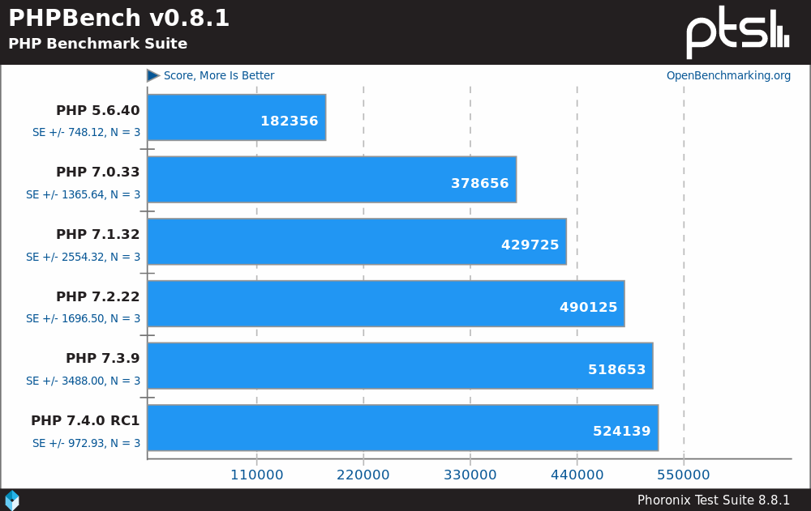

# What's new in *PHP 7.4*

## PHP User Group Rheinhessen #62

### Matthias Gutjahr ([@mattsches](https://twitter.com/mattsches))

---

## About

### Release Managers


- Peter Kokot
- Derick Rethans

### Timeline

- 06.06.2019: PHP 7.4 Alpha 1
- 18.07.2019: Alpha 2
- 28.11.2019: Release

---

## Performance

[PHP 7.4RC1 Benchmarks](https://www.phoronix.com/scan.php?page=news_item&px=PHP-7.4-RC1-Released)



---


---

## [Spread Operator for Array](https://wiki.php.net/rfc/spread_operator_for_array) (43:1)

The _spread_ operator `...` can now be used with Arrays and Traversables.

<div class="example">

```php
$parts = ['apple', 'pear'];
$fruits = ['banana', 'orange', ...$parts, 'watermelon'];
var_dump($fruits);
```
<a href="https://3v4l.org/muWCc">[Demo]</a>
</div>

<div class="example">

```php
function buildArray(): array {
  return ['red', 'green', 'blue'];
}
$arr1 = [...buildArray(), 'pink', 'violet', 'yellow'];
```
<a href="https://3v4l.org/fLocj">[Demo]</a>
</div>

<div class="example">

```php
function generator() {
    for ($i = 3; $i <= 5; $i++) {
        yield $i;
    }
}
$arr1 = [0, 1, 2, ...generator()];
```
<a href="https://3v4l.org/7Svqk">[Demo]</a>
</div>

---

## [Arrow functions 2.0](https://wiki.php.net/rfc/arrow_functions_v2) (51:8)

<div class="example">

```php
$a = [1, 2, 3, 4, 5];
$b = array_map(fn($n) => $n * $n * $n, $a);
print_r($b);
```
<a href="https://3v4l.org/AAlPR">[Demo]</a>
</div>

<div class="example">

```php
$factor = 10;
$calc = function($num) use($factor){
	return $num * $factor;
};

// PHP 7.4
$calc = fn($num) => $num * $factor;
echo $calc(2);
```
<a href="https://3v4l.org/Okv1Z">[Demo]</a>
</div>

---
## [Null Coalescing Assignment Operator](https://wiki.php.net/rfc/null_coalesce_equal_operator) (37:4   )

<div class="example">

```php
$data['comments']['user_id'] = $data['comments']['user_id'] ?? 'value';

// PHP 7.4
$data['comments']['user_id'] ??= 'value';

```
<a href="https://3v4l.org/GQL8I">[Demo]</a>
</div>

---
## [Typed Properties 2.0](https://wiki.php.net/rfc/typed_properties_v2) (70:1)

`bool`, `int`, `float`, `string`, `array`, `object`, `iterable`, `self`, `parent`, any class or interface name, and nullable types (`?type`), but not `void` and `callable`.

<div class="example">

```php
class User {
  public int $id;
  public static iterable $staticProp;
  public string $str = "foo";
  public ?string $nullableStr; // does not default to `null`!
  protected string $name;
  private float $lat, $lon;
}
$user = new User();
$user->id = 123;
$user->str = ['bar']; // Fatal error: Uncaught TypeError

var_dump($user->nullableString) // Uncaught Error …
```
<a href="https://3v4l.org/D7MI3">[Demo]</a>
</div>

---

## [Covariant Returns and Contravariant Parameters](https://wiki.php.net/rfc/covariant-returns-and-contravariant-parameters) (39:1)

[Kovarianz und Kontravarianz](https://de.wikipedia.org/wiki/Kovarianz_und_Kontravarianz) (Wikipedia DE)

<div class="example">

```php
// Kovarianz
interface Factory {
  function make(): object;
}
class UserFactory implements Factory {
  function make(): User;
}

// Kontravarianz
interface Concatable {
  function concat(Iterator $input); 
}
class Collection implements Concatable {
  function concat(iterable $input) {/*…*/} // accepts all iterables, not just Iterator
}
```
</div>

---
## [Numeric literal separator](https://wiki.php.net/rfc/numeric_literal_separator) (33:11)

> Enable improved code readability by supporting an underscore in numeric literals to visually separate groups of digits. 

<div class="example">

```php
$threshold = 1_000_000_000;  // a billion!
$testValue = ‪107_925_284.88; // scale is hundreds of millions
$discount = 135_00;          // $135, stored as cents

6.674_083e-11; // float
299_792_458;   // decimal
0xCAFE_F00D;   // hexadecimal
0b0101_1111;   // binary
0137_041;      // octal
```
</div>

---
## [Preloading](https://wiki.php.net/rfc/preload) (48:0)

`opcache.preload`-Setting in `php.ini`

> Using this directive we will specify a single PHP file - which will perform the preloading task. Once loaded, this file is then fully executed - and may preload other files, either by including them or by using the `opcache_compile_file()` function.

<div class="example">

```php
// preload.php
<?php
function _preload($preload) {/* recursive preloading */}

set_include_path(get_include_path() . PATH_SEPARATOR . realpath("/var/www/ZendFramework/library"));
_preload(["/var/www/ZendFramework/library"]);
```
</div>

>preloaded files remain cached in opcache memory forever. Modification of their corresponding source files won’t have any effect without another server restart.

---
## [New custom object serialization mechanism](https://wiki.php.net/rfc/custom_object_serialization) (20:7)

<div class="example">

```php
class A {
    private $prop_a;
    public function __serialize(): array {
        return ["prop_a" => $this->prop_a];
    }
    public function __unserialize(array $data) {
        $this->prop_a = $data["prop_a"];
    }
}
class B extends A {
    private $prop_b;
    public function __serialize(): array {
        return [
            "prop_b" => $this->prop_b,
            "parent_data" => parent::__serialize(),
        ];
    }
    public function __unserialize(array $data) {
        parent::__unserialize($data["parent_data"]);
        $this->prop_b = $data["prop_b"];
    }
}
```
</div>

---
## [FFI - Foreign Function Interface](https://wiki.php.net/rfc/ffi) (24:15)
>…extend PHP with a simple FFI API designed after LuaJTI/FFI and Python/CFFI […]. This API allows loading shared libraries (.DLL or .so), calling C functions and accessing C data structures, in pure PHP.

<div class="example">

```php
// create FFI object, loading libc and exporting function printf()
$ffi = FFI::cdef(
    "int printf(const char *format, ...);", // this is a regular C declaration
    "libc.so.6");
// call C's printf()
$ffi->printf("Hello %s!\n", "world"); // Hello world!

$x = FFI::new("int");
$x->cdata = 5;
var_dump($x->cdata); // int(5)
```
</div>

---
## [`mb_str_split` - Split multibyte string](https://wiki.php.net/rfc/mb_str_split) (10:1)
<div class="example">

```php
print_r(mb_str_split("победа", 2));
 
// Array
// (
//     [0] => по
//     [1] => бе
//     [2] => да
// )
```
<a href="https://3v4l.org/jC6UM">[Demo]</a>
</div>

---
## [Change the precedence of the concatenation operator](https://wiki.php.net/rfc/concatenation_precedence) (31:4)
<div class="example">

```php
echo "sum: " . $a + $b;
 
// current behavior: evaluated left-to-right
echo ("sum: " . $a) + $b;
 
// desired behavior: addition and subtraction have a higher precendence
echo "sum :" . ($a + $b);
```
<a href="https://3v4l.org/hiRCk">[Demo]</a>
</div>

---


---
## More 1/2
* [Weak References](https://wiki.php.net/rfc/weakrefs): new class `WeakReference`
* [E_WARNING for invalid containers](https://wiki.php.net/rfc/notice-for-non-valid-array-container): `$var = [123]; echo $var[0][1];`
* [base_convert improvements](https://wiki.php.net/rfc/base_convert_improvements): `base_convert("hello world", 16, 10); // 237`
* [Escape PDO "?" parameter placeholder](https://wiki.php.net/rfc/pdo_escape_placeholders): 
`$s = $pdo->prepare('SELECT * FROM tbl WHERE json_col ?? ?'); $s->execute(['foo']); ` 🢧 `SELECT * FROM tbl WHERE json_col ? 'foo'`

---
## More 2/2
* [Password Hashing Registry](https://wiki.php.net/rfc/password_registry) 
  ```
  print_r(password_algos());
  Array (
      [0] => "2y" // Ident for "bcrypt"
      [1] => "argon2i"
      [2] => "argon2id"
  )
  ```
* [Argon2 support from sodium](https://wiki.php.net/rfc/sodium.argon.hash)
* [Allow throwing exceptions from `__toString()`](https://wiki.php.net/rfc/tostring_exceptions) (42:0)
* [Always available hash extension](https://wiki.php.net/rfc/permanent_hash_ext) (30:0)
* [Improve openssl_random_pseudo_bytes()](https://wiki.php.net/rfc/improve-openssl-random-pseudo-bytes) (30:0)
* [Reflection for references](https://wiki.php.net/rfc/reference_reflection) (30:1): `final class ReflectionReference`

---
## Deprecations
* [Deprecate curly braces array and string syntax access](https://wiki.php.net/rfc/deprecate_curly_braces_array_access)
* [Deprecate and remove ext/interbase](https://wiki.php.net/rfc/deprecate-and-remove-ext-interbase)
* [Deprecate left-associative ternary operator](https://wiki.php.net/rfc/ternary_associativity): 
    `return $a == 1 ? 'one' : $a == 2 ? 'two' : $a == 3 ? 'three' : 'other';`
* [Unbundle ext/wddx](https://wiki.php.net/rfc/deprecate-and-remove-ext-wddx)
* [Unbundle ext/recode](https://wiki.php.net/rfc/unbundle_recode)

---
## Links

* All [RFCs für PHP 7.4](https://wiki.php.net/rfc#php_74)
* [Blogpost on Kinsta](https://kinsta.com/blog/php-7-4/)
* [Slides from Nikita Popov](https://www.slideshare.net/nikita_ppv/typed-properties-and-more-whats-coming-in-php-74)

---


## Thanks for listening and discussing!